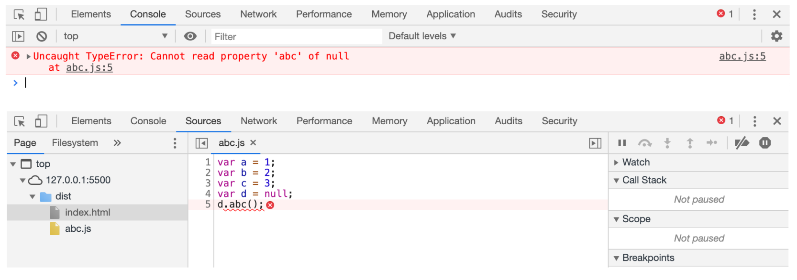
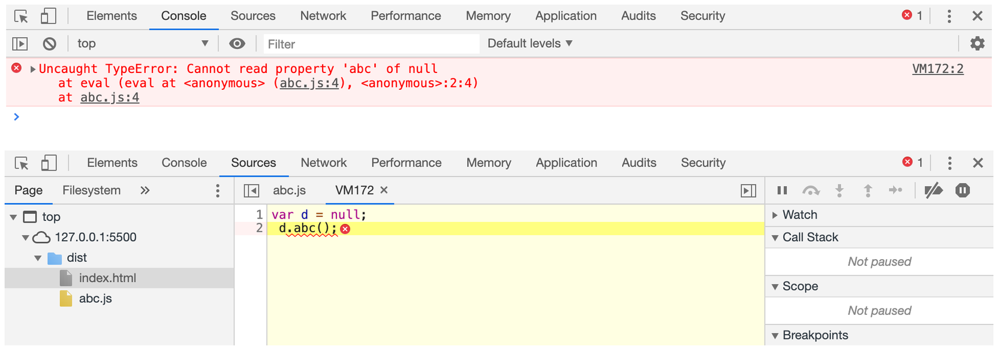
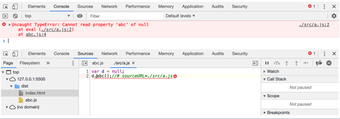
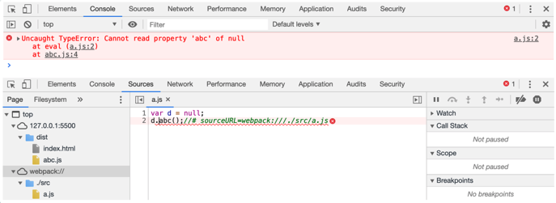

# 编译结果分析 

# **编译结果分析**

## 自己实现my-main.js

1. 用一个`对象`保存所有的模块，以及模块对象的代码

> 以`模块名（模块路径）`作为属性名，`模块代码`放在函数里面执行。

```js
// 合并两个模块
// ./src/a.js
// ./src/index.js
// 1. 用一个对象保存所有的模块，以及模块对象的代码
//   以模块名作为属性名，模块代码放在函数里面
let modules = {
  './src/a.js': function (module, exports, require) {
    // 模块代码
    console.log('this is module a')
    module.exports = 'a'
  },
  './src/index.js': function (module, exports, require) {
    console.log('this is module index')
    // require(路径)：路径要和属性名一致var a=require("./src/a.js")
    console.log(a)
  }
}

```

2. 封装一个函数

> 处理上面的对象。

```js
// 2. 封装一个函数，处理保存所有模块的对象
function deal(modules) {
  let moduleExports = {}
  // 用于缓存模块的导出结果

  // 封装my_require：运行一个模块，得到模块导出结果
  function my_require(moduleId) {
    // 模块Id： 就是模块的路径
    // 检查是否有缓存
    if (moduleExports[moduleId]) {
      return moduleExports[moduleId]
    }
    let func = modules[moduleId]
    // 得到该模块Id对应的函数
    // 构造一个空 module对象
    let module = {
      exports: {}
    }
    func(module, module.exports, my_require)
    // 运行模块,func 函数中 有对module赋值导出
    let result = module.exports
    moduleExports[moduleId] = result
    return result
  }
  // 执行入口模块：require函数相当于是运行一个模块，得到模块导出结果
  my_require('./src/index.js')
}

deal(modules)

```


3. 执行

```js
1.1-编译结果分析 panther$ node dist/my-mainv2.js 
this is module index
this is module a
a
```


4. 优化

> `避免全局污染`，使用立即执行函数。

```js
// 合并两个模块
// ./src/a.js// ./src/index.js
// 2. 封装一个函数，处理保存所有模块的对象
;(function (modules) {
  let moduleExports = {} // 用于缓存模块的导出结果
  // 封装my_require：运行一个模块，得到模块导出结果
  function my_require(moduleId) {
    // 模块Id： 就是模块的路径
    // 检查是否有缓存
    if (moduleExports[moduleId]) {
      return moduleExports[moduleId]
    }
    let func = modules[moduleId] // 得到该模块Id对应的函数
    // 构造一个空 module对象
    let module = {
      exports: {}
    }
    func(module, module.exports, my_require) // 运行模块,func 函数中 有对module赋值导出
    let result = module.exports
    moduleExports[moduleId] = result
    return result
  }
  // 执行入口模块：require函数相当于是运行一个模块，得到模块导出结果
  my_require('./src/index.js')
})(
  // 1. 用一个对象保存所有的模块，以及模块对象的代码
  //   以模块名作为属性名，模块代码放在函数里面
  {
    './src/a.js': function (module, exports, require) {
      // 模块代码
      console.log('this is module a')
      module.exports = 'a'
    },
    './src/index.js': function (module, exports, require) {
      console.log('this is module index')
      // require(路径)：路径要和属性名一致
      var a = require('./src/a.js')
      console.log(a)
    }
  }
)

```


## webpack 打包的源码

```js
() => {
  'use strict'
  var __webpack_modules__ = {
    './src/a.js': (
      __unused_webpack_module,
      __webpack_exports__,
      __webpack_require__
    ) => {
      eval(
        '__webpack_require__.r(__webpack_exports__);\n/* harmony export */ __webpack_require__.d(__webpack_exports__, {\n/* harmony export */   "default": () => (__WEBPACK_DEFAULT_EXPORT__)\n/* harmony export */ });\nonsole.log("this is module a")\n\n/* harmony default export */ const __WEBPACK_DEFAULT_EXPORT__ = (a = \'a\');\n\n\n//# sourceURL=webpack:///./src/a.js?'
      )
    },

    './src/index.js': (
      __unused_webpack_module,
      __webpack_exports__,
      __webpack_require__
    ) => {
      eval(
        '__webpack_require__.r(__webpack_exports__);\n/* harmony import */ var _a__WEBPACK_IMPORTED_MODULE_0__ = __webpack_require__(/*! ./a */ "./src/a.js");\n\n\nonsole.log("this is module index")\nconsole.log(_a__WEBPACK_IMPORTED_MODULE_0__["default"])\n\n\n//# sourceURL=webpack:///./src/index.js?'
      )
    }
  }

  var __webpack_module_cache__ = {} // The require function

  function __webpack_require__(moduleId) {
    var cachedModule = __webpack_module_cache__[moduleId]
    if (cachedModule !== undefined) {
      return cachedModule.exports
    } // Create a new module (and put it into the cache)
    var module = (__webpack_module_cache__[moduleId] = {
      exports: {}
    })

    __webpack_modules__[moduleId](module, module.exports, __webpack_require__) // Return the exports of the module

    return module.exports
  }

  ;(() => {
    __webpack_require__.d = (exports, definition) => {
      for (var key in definition) {
        if (
          __webpack_require__.o(definition, key) &&
          !__webpack_require__.o(exports, key)
        ) {
          Object.defineProperty(exports, key, {
            enumerable: true,
            get: definition[key]
          })
        }
      }
    }
  })()
  ;(() => {
    __webpack_require__.o = (obj, prop) =>
      Object.prototype.hasOwnProperty.call(obj, prop)
  })()
  ;(() => {
    __webpack_require__.r = (exports) => {
      if (typeof Symbol !== 'undefined' && Symbol.toStringTag) {
        Object.defineProperty(exports, Symbol.toStringTag, {
          value: 'Module'
        })
      }
      Object.defineProperty(exports, '__esModule', {value: true})
    }
  })()
  var __webpack_exports__ = __webpack_require__('./src/index.js')
})()

```

## eval

**为什么使用eval?**

1. 不使用eval，当执行报错时

```js
var a =1;
var b=2;
var c=3;
var d=null;
d.abc()
```



2. 使用eval，当执行报错时

> eval 中的代码是放在另一个环境中执行的，浏览器认为是单独的执行环境，这样就看不到其他代码的干扰了，
>
> 更加容易调试。
>
> `VM172:2` ： VM172是 js执行引擎的虚拟机编号。

```js
vara=1;
varb=2;
varc=3;
eval("var d = null; \n d.abc();")
```



3. `sourceURL`

> 告诉浏览器，触发调试时，显示的路径。

    vara=1;
    varb=2;
    varc=3;
    eval("var d = null;\nd.abc();//# sourceURL=./src/a.js")



> `//# sourceURL=webpack:///./src/a.js"`
>
> 在调试的时候，会把`a.js`加到这个目录下，不是真的存在这个目录和这个文件，只是浏览器调试的一种手段。

    vara=1;
    varb=2;
    varc=3;
    eval("var d = null;\nd.abc();//# sourceURL=webpack:///./src/a.js")




