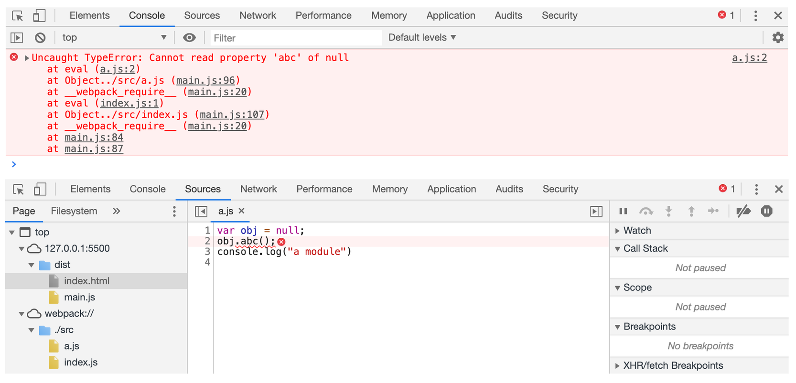

# 案例

## devool 未配置时打包

- src

> `a.js`

    varobj=null;
    obj.abc();
    console.log("a module")

> `index.js`

    require("./a")
    console.log("index module")

- `dist/index.html`

```js
<!DOCTYPE html>
<html lang="en">
<head>
    <meta charset="UTF-8">
    <meta name="viewport" content="width=device-width, initial-scale=1.0">
    <meta http-equiv="X-UA-Compatible" content="ie=edge">
    <title>Document</title>
</head>
<body>
    <script src="./main.js"></script>
</body>
</html>

```

> 报错显示在`具体的源文件`：是因为 sourceURL。

- 开发环境打包 `npx webpack --mode=development`



- 生产环境打包`npx webpack`

> 报错显示在真实运行的 js 文件中。


